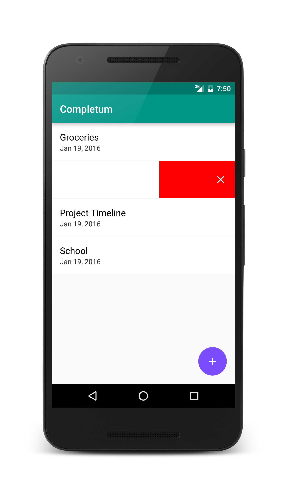
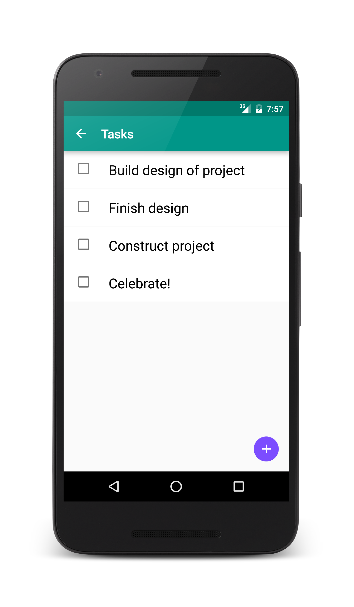

# Completum
Completum là danh sách việc cần làm dành riêng cho chủ nghĩa tối giản và năng suất. Dễ dàng tạo, xóa và hoàn thành các công việc và danh sách việc cần làm để tối đa hóa tiềm năng năng suất của bạn. Tôi đã phát hành tất cả mã cho ứng dụng này để cung cấp hướng dẫn và trợ giúp cho những cá nhân muốn tìm hiểu cách phát triển Android.

"# AppToDo" 
